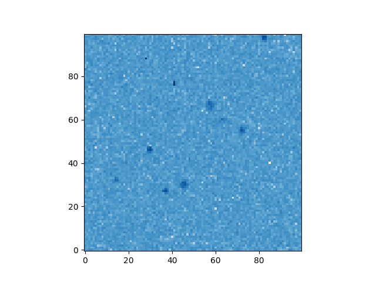
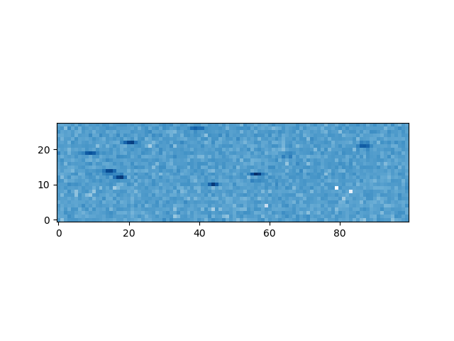
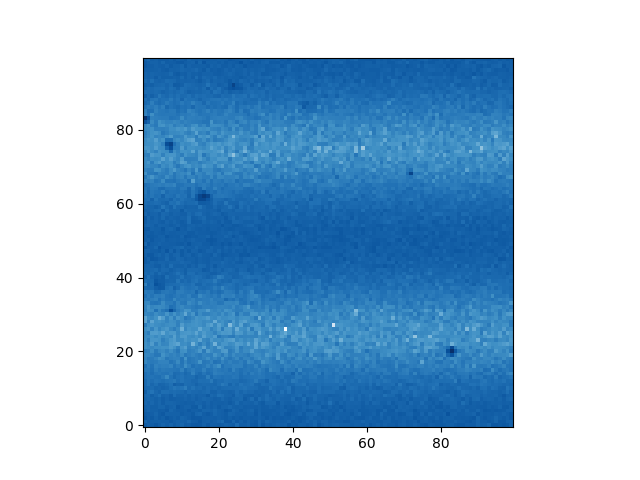

# CONNIEtools
Analysis tools for the CONNIE colaboration

This is a set of tool for analysing the CONNIE 

visit https://github.com/PhMota/CONNIEtools/wiki for more details

### Simulation

The `simulate` tool is responsable for generating simulated images. The implemented functionalities and defaults are described by the `--help` as
```sh
$ ./simulation image --help
usage: simulation image [-h] [-g CHARGE_GAIN] [-rn READOUT_NOISE]
                        [-dc DARK_CURRENT] [-exp EXPOSE_HOURS]
                        [-os HORIZONTAL_OVERSCAN] [-vos VERTICAL_OVERSCAN]
                        [--ccd-shape CCD_SHAPE CCD_SHAPE]
                        [--rebin REBIN REBIN] [--image-type IMAGE_TYPE]
                        [--image-mode IMAGE_MODE]
                        [--depth-range DEPTH_RANGE DEPTH_RANGE]
                        [--diffusion-function DIFFUSION_FUNCTION]
                        [--charge-efficiency-function CHARGE_EFFICIENCY_FUNCTION]
                        [-N NUMBER_OF_CHARGES]
                        [--charge-range CHARGE_RANGE CHARGE_RANGE]
                        [--number-of-Cu-charges NUMBER_OF_CU_CHARGES]
                        [--number-of-Cu2-charges NUMBER_OF_CU2_CHARGES]
                        [--number-of-Si-charges NUMBER_OF_SI_CHARGES]
                        [--vertical-modulation-function VERTICAL_MODULATION_FUNCTION]
                        [--horizontal-modulation-function HORIZONTAL_MODULATION_FUNCTION]
                        [--default-vertical-modulation DEFAULT_VERTICAL_MODULATION]
                        [--default-horizontal-modulation DEFAULT_HORIZONTAL_MODULATION]
                        [--default-modulation DEFAULT_MODULATION] [--no-fits]
                        [--pdf] [--spectrum] [--verbose VERBOSE] [--csv]
                        basename

positional arguments:
  basename                  basename for simulation output

optional arguments:
  -h, --help            show this help message and exit

parameter options:
  -g CHARGE_GAIN, --charge-gain CHARGE_GAIN
                        factor to convert charges into ADU (default: 7.25)
  -rn READOUT_NOISE, --readout-noise READOUT_NOISE
                        sigma of the normal noise distribution in ADU
                        (default: 0)
  -dc DARK_CURRENT, --dark-current DARK_CURRENT
                        lambda of Poisson distribution in 1/(e-·h) (default:
                        0)
  -exp EXPOSE_HOURS, --expose-hours EXPOSE_HOURS
                        exposed hours (default: 1)

geometry options: 
  -os HORIZONTAL_OVERSCAN, --horizontal-overscan HORIZONTAL_OVERSCAN
                        size of the horizontal overscan in pixels (default:
                        150)
  -vos VERTICAL_OVERSCAN, --vertical-overscan VERTICAL_OVERSCAN
                        size of the vertical overscan in pixels (default: 90)
  --ccd-shape CCD_SHAPE CCD_SHAPE
                        shape of the image as 2d pixels (default: (4130,
                        4120))
  --rebin REBIN REBIN   2d rebinning strides (default: [1, 1])
  --image-type IMAGE_TYPE
                        image type (default: int)
  --image-mode IMAGE_MODE
                        set to "1" to use official 1x1 image geomtry or "5" to
                        1x5

depth options:
  --depth-range DEPTH_RANGE DEPTH_RANGE
                        range into which to randomly generate depths (default:
                        [0, 670])
  --diffusion-function DIFFUSION_FUNCTION
                        function to map z-depth into xy-sigma (default:
                        sqrt(-258.817238*log1p(-0.000982*z))/15 if z < 670
                        else 0)
  --charge-efficiency-function CHARGE_EFFICIENCY_FUNCTION
                        function for charge efficiency dependent of z-depth
                        (default: 1. if z < 670 else .9)

charge options:   
  -N NUMBER_OF_CHARGES, --number-of-charges NUMBER_OF_CHARGES
                        number of charges to be randomly generated (default:
                        0)
  --charge-range CHARGE_RANGE CHARGE_RANGE
                        range into which to randomly generate charges
                        (default: [5, 200])
  --number-of-Cu-charges NUMBER_OF_CU_CHARGES
                        number of charges to be randomly generated at the
                        Copper fluorescence energy 8.046keV (default: 0)
  --number-of-Cu2-charges NUMBER_OF_CU2_CHARGES
                        number of charges to be randomly generated at the
                        secundary Copper fluorescence energy 8.904keV
                        (default: 0)
  --number-of-Si-charges NUMBER_OF_SI_CHARGES
                        number of charges to be randomly generated at the
                        Silicon fluorescence energy 1.740keV (default: 0)

modulation options:
  --vertical-modulation-function VERTICAL_MODULATION_FUNCTION
                        function to modulate the vertical axis (default: 0)
  --horizontal-modulation-function HORIZONTAL_MODULATION_FUNCTION
                        function to modulate the horizontal axis (default: 0)
  --default-vertical-modulation DEFAULT_VERTICAL_MODULATION
                        set vertical modulation to "50*cos(y/2/pi/20)"
  --default-horizontal-modulation DEFAULT_HORIZONTAL_MODULATION
                        set horizontal modulation to "-1e3*(x/1000. - 1)**2 if
                        x < 1000. else 0"
  --default-modulation DEFAULT_MODULATION
                        set modulations to "-1e3*(x/1000. - 1)**2 if x < 1000.
                        else 0" and "50*cos(y/2/pi/20)"

output options:   
  --no-fits             suppress fits output
  --pdf                 generate pdf output
  --png                 generate png output
  --spectrum            generate energy spectrum
  --verbose VERBOSE     verbose level
  --csv                 generate csv output
```

The only necessary option is the `basename` which specifies the basename for the output files, the rest of the options will fall to their defaults.
A test run

```sh
$ ./simulation image test
using parameters:
        number_of_Si_charges 0 rebin [1, 1] readout_noise 0 image_type <type 'int'> horizontal_overscan 150 basename test 
        number_of_charges 0 vertical_modulation_function 0 ccd_shape (4130, 4120) depth_range [0, 670] expose_hours 1 
        diffusion_function sqrt(-258.817238*log1p(-0.000982*z))/15 if z < 670 else 0 number_of_Cu_charges 0 charge_gain 7.2500 vertical_overscan 90 
        horizontal_modulation_function 0 dark_current 0 charge_efficiency_function 1. if z < 670 else .9 charge_range [5, 200] number_of_Cu2_charges 0 
generated fits 0s105ms
saved test.fits 0s364ms
finished 0s950ms
```

prints all options used and the time for generating the fits image, the time for saving the image and the total run time.
This run generated complete black images with no readout noise, no dark current and no simulated single-hit charges.
A sample

```sh
$ ./simulation image sample -N 10 -dc .1 -rn 12 -g 7.25 --image-type float -os 10 -vos 10 --ccd-shape 90 90 --png --csv
using parameters:
        number_of_Cu_charges 0 horizontal_overscan 10 basename sample expose_hours 1 readout_noise 12.0000 horizontal_modulation_function 0 
        charge_gain 7.2500 charge_range [5, 200] number_of_Si_charges 0 rebin [1, 1] image_type <type 'float'> number_of_charges 10 
        vertical_overscan 10 csv True ccd_shape [90, 90] func <function image at 0x7f75582100c8> charge_efficiency_function 1. if z < 670 else .9 
        png True number_of_Cu2_charges 0 vertical_modulation_function 0 depth_range [0, 670] 
        diffusion_function sqrt(-258.817238*log1p(-0.000982*z))/15 if z < 670 else 0 dark_current 0.1000 
saved sample.png 0s394ms
generated fits 0s6ms
saved sample.fits 0s538ms
finished 0s953ms
```

together with the `sample.fits` output, it also generates the  `sample.csv` file
```csv
# {'number_of_Cu_charges': 0, 'horizontal_overscan': 10, 'basename': 'sample', 'expose_hours': 1, 'readout_noise': 12.0, 'horizontal_modulation_function': '0', 'charge_gain': 7.25, 'charge_range': [5, 200], 'number_of_Si_charges': 0, 'rebin': [1, 1], 'image_type': <type 'float'>, 'number_of_charges': 10, 'vertical_overscan': 10, 'csv': True, 'ccd_shape': [90, 90], 'func': <function image at 0x7f75582100c8>, 'charge_efficiency_function': '1. if z < 670 else .9', 'png': True, 'number_of_Cu2_charges': 0, 'vertical_modulation_function': '0', 'depth_range': [0, 670], 'diffusion_function': 'sqrt(-258.817238*log1p(-0.000982*z))/15 if z < 670 else 0', 'dark_current': 0.1}
# x, y, z, q, id
8.3630, 54.0214, 16.7683, 146.9022, random
24.4361, 9.8991, 406.4256, 21.6504, random
76.6522, 19.1008, 541.9560, 157.5956, random
72.1244, 38.9625, 343.4112, 16.4292, random
12.8701, 69.9500, 467.4386, 22.8460, random
9.3977, 74.3152, 78.7057, 32.2837, random
15.1221, 40.3824, 514.1709, 133.0789, random
76.5377, 29.2888, 256.5385, 64.1979, random
62.4611, 48.3711, 310.7852, 146.8428, random
85.3338, 63.2695, 243.6118, 27.5811, random
```
and the `sample.png` file



```sh
$ ./simulation image sample5 -N 10 -dc .1 -rn 12 -g 7.25 --image-type float -os 10 -vos 10 --ccd-shape 90 90 --png --csv --rebin 5 1
```




```sh
$ ./simulation image sample5mod -N 10 -dc .1 -rn 12 -g 7.25 --image-type float -os 10 -vos 10 --ccd-shape 90 90 --png --csv --vertical-modulation-function '50*cos(2*pi*y/50)'
```


### Notes

The careful reader might catch the fact that the axes are inverted in the default CCD shape `[4130,4120]`.
In fact, this has been an intentional choice, albeit potentially confusing for the user.
This is to keep comatibility with the CONNIE fit files which have the axes inverted also. 
The rebin feature is supposed to be given as `--rebin 5 1` to emulate the 1x5 rebinning.

Also the vertical overscan apperas at the bottom of the image.
This is also made to mimick the offical fit images which are written backwards.
